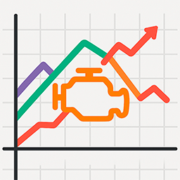
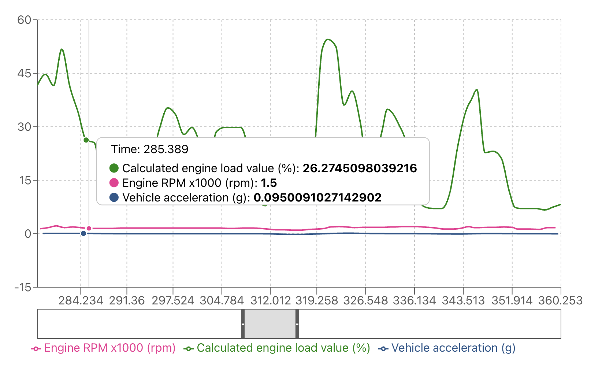

  

<h1 align="center">CarLog Visualizer</h1>

  A lightweight web tool to visualize car diagnostics data from CSV logs.

  <a href="https://egorvah.github.io/CarLog-Visualizer">🌐 Try it now</a>

---

## 🚗 Overview

**CarLog Visualizer** is a browser-based tool designed to help you analyze automotive diagnostic logs in CSV format.  
It runs entirely in your browser — no server required.

- 📈 Interactive data graphs
- 🛡️ Secure: your data stays private — everything is processed locally in your browser.

---

## 📂 Supported Log Formats

- ✅ **Car Scanner Android/iOS** (Car Scanner ELM OBD2)
- ✅ **VCDS** (VAG-COM Diagnostic System)

---

## 📸 Screenshots

---

## 🚀 Getting Started

Just visit the site and upload your CSV log:
👉 [**Launch App**](https://egorvah.github.io/CarLog-Visualizer)